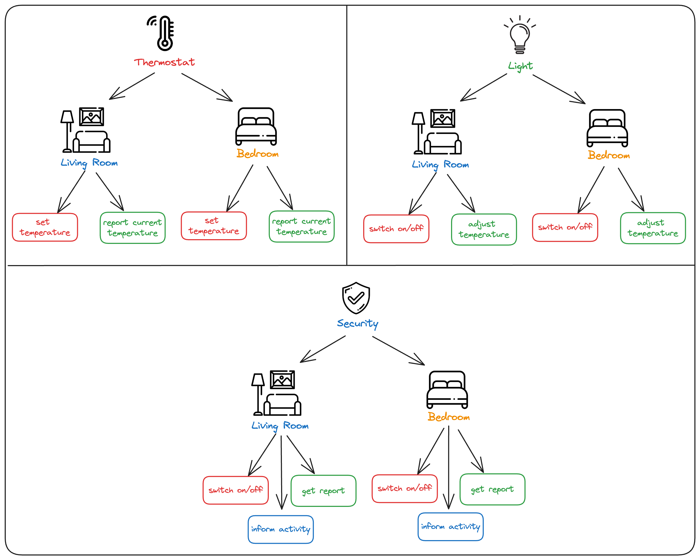

# Hierarchical Channels

# 1. Introduction

Hierarchical channels in a messaging or communication system refer to a structured way of organizing message flow, resembling a tree-like hierarchy. This structure is particularly beneficial in systems where messages need to be categorized and managed according to different criteria or types, such as in IoT systems, distributed applications, or complex event-driven architectures.

## 1.1 Structure and Functionality

1. **Levels**: The hierarchy typically consists of multiple levels, with each level representing a different category or type of message.
2. **Channels at Each Level**: Each level in the hierarchy has its own set of channels, and these channels are usually strongly typed.
3. **Message Flow**: Messages flow through these channels, often requiring transformation or routing based on the level they are in or the type of data they carry.

## 1.2 The Consumer Role

In a general sense, consumers in a hierarchical messaging system work by subscribing to and processing messages from various levels of the hierarchy. Some protocols allow consumers to use wildcards or patterns to subscribe to multiple channels simultaneously. For instance, subscribing to **`home/+/temperature`** might let a consumer receive temperature messages from all rooms in a home.

Consumers can selectively process messages based on the channel or topic they arrive on, allowing for more organized and efficient handling of data. In some systems, consumers can dynamically change their subscriptions, adding or removing channels as needed, allowing for flexible response to changing conditions or requirements.

# 2. Project Description

This project aims to develop a hierarchical messaging system tailored for a smart home IoT environment.

## 2.1 Primary Goals

- **Efficient Message Routing**: Implement a hierarchical messaging structure that enables efficient routing of messages to appropriate IoT devices and services within a smart home ecosystem.
- **Scalability and Flexibility**: Ensure the system can easily scale to accommodate an increasing number of devices and message types, with the flexibility to integrate new devices and functionalities.
- **Real-Time Data Handling**: Develop the capability to handle real-time data from IoT devices, such as temperature sensors, lights, and security cameras, ensuring timely processing and response.
- **Reliable and Fault-Tolerant Design**: Create a robust system that maintains high reliability and fault tolerance, capable of handling connection losses and message redelivery.
- **Dynamic Subscription Management**: Allow dynamic subscription management for consumers, enabling them to adapt to changing message patterns and hierarchies.

## 2.2 Business Overview

We will mock an IoT scenario focused on a smart home system. Whenever targeted actions happen, they will trigger events to our message system. Our application is based on three different levels of events: device type, location (which room they are in) and specific action. It is important we keep everything that happened available for lookups in the future. Let's look at them with more details.

### 2.2.1 **Level 1: Device Type**

This is the topmost level in the hierarchy, representing broad categories of devices in the smart home. We will work with three main devices:

1. **Thermostats**: Temperature control devices.
2. **Lights**: All lighting devices.
3. **Security**: Security-related devices like cameras and alarms.

### 2.2.2 **Level 2: Individual Device Location**

The second level identifies individual devices within each category, which we will simplify by which room they are in. Note that this would make it difficult to have multiple lamps in the same room, for example, at the cost of making our application easier to follow.

We will have two different locations, **Living Room** and **Bedroom**. This means in each of them there may be at most one of each device referring to **Thermostats**, **Lights** and **Security**. This should produce this view:

1. **Thermostats**
    1. **Living Room**
    2. **Bedroom**
2. **Lights**
    1. **Living Room**
    2. **Bedroom**
3. **Security**
    1. **Living Room**
    2. **Bedroom**

### 2.2.3 **Level 3: Device Actions or Statuses**

This level is the most granular, involving specific actions to be taken or statuses to be reported by the devices. The actions have no restriction of location, so anything that happens in the living room may as well happen in the bedroom.

1. **Thermostats**
    1. **Set Temperature**
    2. **Report Current Temperature**
2. **Lights**
    1. **Switch On**
    2. **Switch Off**
    3. **Adjust Brightness**
3. **Security**
    1. **Switch On**
    2. **Switch Off**
    3. **Inform Activity (the user manually informs if, for example, something suspicious happened)**
    4. **Get Report (this will make the device return informed activities in the last 24 hours, if any).**

This is a general view of our functionalities.

## 2.3 Defining Our Subscribers

To make things fun, let's define many consumer/subscriber options.  We will not explore all possible combinations for the sake of brevity.

### 2.3.1 Direct Subscribers

These are the subscribers that actually execute the user's requests. They are all related to the last level.

1. **Temperature Adjustment**: Listens for temperature set commands for any thermostat in the home and adjusts the temperature of the specified thermostat accordingly.
2. **Temperature Report**: Listens for temperature report commands and generates them according to the current temperature. The result will be echoed in a designated file.
3. **Light Switch:** Listens for lights commands of on/off switch.
4. **Light Brightness**: Listens for brightness adjustments commands for any light in the home and adjust the brightness accordingly.
5. **Security Switch**: Listens for security commands of on/off switch.
6. **Security Inform**: Listens for activity information commands and stores them accordingly.
7. **Security Report**: Listens for security report commands and generates them according to the current what happened in the last 24 hours. The result will be echoed in a designated file.

### 2.3.2 Secondary Subscribers

These ones will listen to higher levels and perform custom actions.

1. **Environment Controller**: Listens to all temperature and light commands, and makes some adjustments according to inputs. If, for example, the user requests to increase the temperature, it may automatically increases the brightness of that location.
2. **User Security Predictor**: Listens to all security report, information and management commands and stores the data to determine the best time of the day to suggest the report, if the user has not yet, along customized messages and suggestions.
3. **Bedroom/Living Room Location Controller**: One for each location. Listens to all events regarding that location and generates reports accordingly.

## 2.4 Technology Debrief

- **Application:** We will use **`Golang`** to implement our publishers and subscribers
- **Message Broker:** **`Docker Compose`** will be responsible to spin our broker through the base **`RabbitMQ`** image. The communication will be through the MQTT protocol.
- **Event Storage**: We will store each entry in every subscriber in a Timeseries Database using **`InfluxDB`**. We will use its docker image as well with `**Docker Compose**`.
- **Immediate Reports**: We will keep the most recent temperature and the last 24 hours of security information in a `**Memcached**` component. It will also be containerized with `**Docker Compose**`.
- **Advanced Reports**: As it does not require strong constraints, we will use a **`MongoDB`** database to store our more complex reports, generated by the secondary subscribers. It will also be containerized with `**Docker Compose**`.

## 2.5 Assumptions

Since this is just a simulation and we will not deal with actual devices, our publishers, instead of real thermostats and such, will be scripts that will be manually trigger by us to generate messages. Most specifically, they will be exact counterparts for our direct consumers.

1. **Temperature Adjustment**
2. **Temperature Report**
3. **Light Switch**
4. **Light Brightness**
5. **Security Switch**
6. **Security Inform**
7. **Security Report**

With these scripts in hand (implementation in later section), we will be able to test our system and check its behavior. After that, we may create an interactive interface for dynamic command input.

# Architecture

Now that we have our business requirements and technologies that will be used, let's draw our system for a definitive view.

# Implementation

## Message Broker

## Cache

## Timeseries Database

## NoSQL Database

## Consumers

## Publishers

## Containerization

# Testing the System
